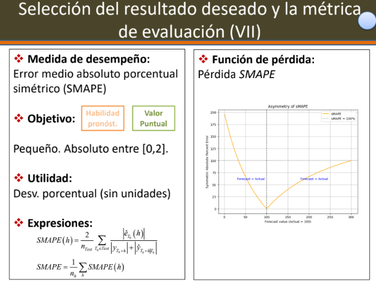
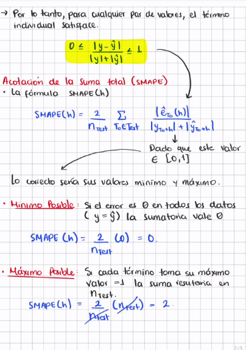

# A. Metodología general de pronósticos y modelos de suavizamiento exponencial (ETS)

1.  Para cada una de las siguientes siguaciones, identifique:

    (a) La variable de interés a modelar

     (b) La periodicidad de la serie (y características o componentes adicionales que se identifiquen en el contexto)

    (c) El horizonte de predicción de interés para un modelo de pronósticos

    (d) los pasos adelante en los cuales en realidad interesa pronosticar,
    (e) la estrategia de ventana,
    (f) la estrategia de calibración,
    (g) el resultado de interés (pronósticos puntuales, por intervalo o densidades), y
    (h) las métricas de evaluación de acuerdo con el contexto,
    (i) un posible modelo base (benchmark) con base en el cual se quisiera contrastar el desempeño del modelo que se va a proponer.

:::: {.callout-note collapse="true"}
## Situación 1: Ruta Bogotá - Popayán

Una aerolínea analiza la cantidad de pasajeros diarios en la ruta Bogotá-Popayán durante los últimos 4 años.

```{r}
#| echo: false
#| message: false
#| warning: false
#| paged-print: false
library(plotly)

# 1. Coordenadas de la ruta BOG -> PPN
coord_bog <- c(-74.1469, 4.7016)
coord_ppn <- c(-76.6094, 2.4544)

# 2. Generar puntos intermedios para la animación
num_puntos <- 80
lons <- seq(coord_bog[1], coord_ppn[1], length.out = num_puntos)
lats <- seq(coord_bog[2], coord_ppn[2], length.out = num_puntos)

# 3. Crear el DataFrame con los frames para la animación
datos_vuelo <- data.frame(
  frame = 1:num_puntos,
  lon = lons,
  lat = lats
)

# 4. Crear el gráfico con plot_geo (NO requiere Token)
plot_geo() %>%
  # Marcadores de los Aeropuertos
  add_trace(
    type = "scattergeo",
    mode = "markers+text",
    lon = c(coord_bog[1], coord_ppn[1]),
    lat = c(coord_bog[2], coord_ppn[2]),
    text = c("Bogotá (BOG)", "Popayán (PPN)"),
    textposition = "top right",
    marker = list(size = 10, color = "#831843"),
    name = "Aeropuertos"
  ) %>%
  # Línea de la Ruta
  add_trace(
    type = "scattergeo",
    mode = "lines",
    lon = lons,
    lat = lats,
    line = list(width = 3, color = "#ec4899"),
    name = "Ruta"
  ) %>%
  # Avión animado
  add_trace(
    type = "scattergeo",
    mode = "markers",
    data = datos_vuelo,
    lon = ~lon,
    lat = ~lat,
    frame = ~frame,
    marker = list(size = 14, color = "#831843", symbol = "airport"),
    name = "Avión",
    showlegend = FALSE
  ) %>%
  # Enfocar el mapa en Colombia
  layout(
    geo = list(
      scope = "south america",
      showland = TRUE,
      landcolor = "#fce7f3",
      showcountries = TRUE,
      countrycolor = "#db2777",
      center = list(lon = -75.3, lat = 3.6),
      projection = list(scale = 12)
    ),
    margin = list(l = 0, r = 0, t = 10, b = 0)
  ) %>%
  # Ajustar velocidad del avión
  animation_opts(
    frame = 50,
    transition = 0,
    redraw = TRUE
  )
```

Las ventas muestran patrones semanales claros (viajes de negocios entre semana, ocio fines de semana) y picos en temporadas vacacionales y festivos.

::: {.callout-note collapse="true"}
## ▶ Componentes de la Metodología de Pronósticos

| Componente | Descripción en el Contexto (Bogotá - Popayán) |
|:-----------------------------------|:-----------------------------------|
| **(a) Variable de interés a modelar** | Cantidad diaria de pasajeros en la ruta Bogotá - Popayán. |
| **(b) Periodicidad y componentes** | **Diaria.** Presenta estacionalidad semanal (picos los L, V, D), estacionalidad anual (temporadas vacacionales/festivos) y tendencia de crecimiento. |
| **(c) Horizonte de predicción** | Corto / Mediano plazo (ej. los próximos 30 a 90 días para planeación operativa). |
| **(d) Pasos adelante de interés** | $h = 1, 2, \dots, 30$ días adelante. |
| **(e) Estrategia de ventana** | Ventana expansiva o ventana móvil (ej. últimos 2 ó 3 años de datos). |
| **(f) Estrategia de calibración** | Reentrenamiento periódico (semanal o mensual) a medida que ingresan datos nuevos. |
| **(g) Resultado de interés** | Pronósticos puntuales y por intervalos de confianza (para evaluar escenarios de alta/baja demanda). |
| **(h) Métricas de evaluación** | RMSE, MAE o MAPE (evaluados en la muestra de validación/prueba). |
| **(i) Modelo base (*benchmark*)** | Modelo Naïve estacional (mismo día de la semana anterior o misma fecha del año anterior). |
:::
::::

:::: {.callout-note collapse="true"}
## Situación 2: Banco de la República

- El banco de la República analiza la **inflación mensual** de los últimos 20 años.

- El ve variables tipo:

  - ::: {}
    | Variables               |
    |-------------------------|
    | Tipo de Cambio          |
    | Precios Internacionales |
    | Tasas de Interés        |
    |                         |
    :::

- La inflacion presenta:

  - 

    | Persistencia Temporal (Lo que ocurre en un mes afecta el siguiente) |
    |---------------------------------------------------------------------|
    | Cambios Estructurales (Crisis economicas o reformas)                |

- Las decisiones de politica monetaria se toman en reuniones mensuales, pero sus efectos se materializan con rezagos.

- Por ello, el banco está interesado en pronosticar la inflación a 1 año, de modo que se analice la situacion tanto en corto como en el mediano plazo y así evaluan escenarios futuros

  | Corto Plazo   | ?   |
  |---------------|-----|
  | Mediano Plazo | ?   |

Ha habido críticas sobre la manera como el Banco pondera los errores de **subpronóstico** y **sobrepronóstico** de la inflación , así que estan interesados en brindar información al gobierno, más allá de un pronostico puntual,


considerando la dispersión asociada al problema de pronósticos de inflación.

Al modelo se le incorpora la información observada cada mes, sin embargo, se considera que un modelo económico del pais tiene un efecto temporal largo sobre el país.

Razón por la cuál, solo se reespecifican sus componenetes y reestiman los parámetros cuando ocurren cambios de gobierno.

::: {.callout-note collapse="true"}
## ▶ Componentes de la Metodología de Pronósticos

| Componente | Descripción en el Contexto (Banco de la República - Inflación Mensual) |
|:-----------------------------------|:-----------------------------------|
| **(a) Variable de interés a modelar** | Inflación mensual en Colombia (variación porcentual del IPC), acompañada de covariables clave (tipo de cambio, precios internacionales y tasas de interés). |
| **(b) Periodicidad y componentes** | **Mensual.** Presenta alta persistencia temporal (autocorrelación), posible estacionalidad anual y cambios estructurales (por crisis económicas, shocks de oferta o reformas). |
| **(c) Horizonte de predicción** | Mediano plazo (**12 meses / 1 año adelante**) para evaluar el impacto con rezagos de la política monetaria en el corto y mediano plazo. |
| **(d) Pasos adelante de interés** | $h = 1, 2, \dots, 12$ meses adelante. |
| **(e) Estrategia de ventana** | Ventana expansiva de largo plazo (aprovechando la historia de los últimos 20 años para capturar el efecto temporal extenso del modelo económico). |
| **(f) Estrategia de calibración** | Actualización mensual de la información observada (reestimación de parámetros), con reespecificación estructural del modelo únicamente a largo plazo. |
| **(g) Resultado de interés** | Pronósticos puntuales, intervalos de predicción y distribución del error/densidades de pronóstico (foco en la dispersión y asimetría para evaluar subpronóstico vs. sobrepronóstico). |
| **(h) Métricas de evaluación** | Funciones de pérdida asimétricas (ej. LINEX o Check Loss), además de métricas convencionales evaluadas en validación (RMSE, MAE, MAPE). |
| **(i) Modelo base (*benchmark*)** | Modelo Naïve persistente (última inflación observada), AR(1) / ARIMA univariado sin covariables o inflacion objetivo/inercial. |
:::
::::

2.  Muestre que la expresión del SMAPE vista en clase, hace que esta métrica se encuentre siempre entre 0 y 2.

:::: {.callout-note collapse="true"}
## SMAPE


](images/clipboard-3197265741.png){fig-align="left"}
:::
